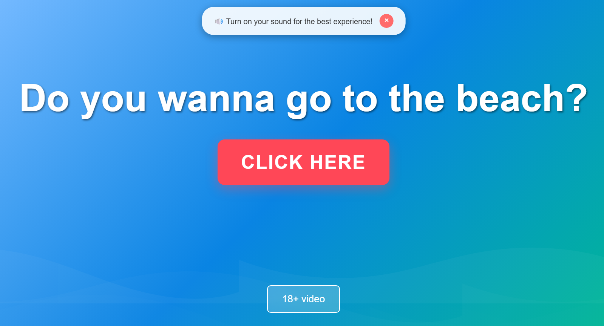

# 🏖️ Vamos a la Playa

A fun, interactive beach-themed webpage that asks users if they want to go to the beach and plays videos based on their choice.



## 🌊 Features

- **Animated Ocean Background**: Beautiful CSS-only wave animations that create a mesmerizing ocean effect
- **Interactive Video Player**: Two different video options with full-screen support
- **Mobile Optimized**: Responsive design that works perfectly on phones and tablets
- **Sound Notification**: Friendly reminder to turn on sound for the best experience
- **Touch Controls**: Double-tap to fullscreen on mobile devices
- **Background Animation Control**: Wave animation stops during certain videos for better focus

## 🎬 How It Works

### Main Experience

1. **Welcome Screen**: Users see an animated ocean background with the question "Do you wanna go to the beach?"
2. **Main Video**: Click the large red "Click here" button to play the main beach video (`video1.mp4`)
3. **Alternative Content**: A smaller "18+ video" button at the bottom plays alternative content (`video2.mp4`)

### Video Features

- **Full-screen playback** with custom controls
- **Auto-close** when video ends
- **Escape key** or click outside to close
- **Background animation pause** for focused viewing (18+ content)
- **Mobile-friendly** touch controls

## 📱 Mobile Optimization

- **Responsive Design**: Scales beautifully from phones to desktop
- **Touch-Friendly**: Large buttons optimized for finger taps
- **Orientation Support**: Works in both portrait and landscape modes
- **Fullscreen Video**: Double-tap video to enter fullscreen mode
- **Smooth Animations**: Optimized performance on mobile devices

## 🛠️ Technical Details

### Technologies Used

- **HTML5**: Semantic structure and video elements
- **CSS3**: Advanced animations, responsive design, and modern styling
- **Vanilla JavaScript**: Interactive functionality and video controls

### File Structure

```
vamos-a-la-playa/
├── index.html          # Main HTML file
├── styles.css          # All styling and animations
├── script.js           # Interactive functionality
├── README.md           # This file
└── src/
    ├── video1.mp4      # Main beach video
    ├── video2.mp4      # Alternative content
    └── img1.png        # Screenshot
```

### Key Features Implementation

#### Animated Ocean Waves

- Pure CSS animations using SVG wave patterns
- Multiple wave layers with different speeds
- Smooth, continuous movement effect

#### Responsive Video Player

- Custom video container with overlay controls
- Auto-play with fallback instructions
- Cross-browser fullscreen support

#### Mobile Touch Controls

- Double-tap to fullscreen detection
- Touch event handling for smooth interaction
- Orientation change support

## 🚀 Getting Started

1. **Clone or Download** the repository
2. **Open** `index.html` in any modern web browser
3. **Enjoy** the beach experience!

### Requirements

- Modern web browser (Chrome, Firefox, Safari, Edge)
- JavaScript enabled
- Video files in the `src` folder

## 🎨 Customization

### Changing Videos

Replace `video1.mp4` and `video2.mp4` in the `src` folder with your own videos.

### Styling

- Modify `styles.css` to change colors, animations, or layout
- Wave animation speed can be adjusted in the CSS animation properties
- Button styles and sizes are fully customizable

### Functionality

- Edit `script.js` to modify video behavior
- Add new interactive elements or features
- Customize mobile touch interactions

## 🌟 Browser Support

- ✅ Chrome (recommended)
- ✅ Firefox
- ✅ Safari
- ✅ Edge
- ✅ Mobile browsers (iOS Safari, Chrome Mobile)

## 📋 Features Checklist

- [x] Animated moving background
- [x] Full-screen banner with question
- [x] Large red action button
- [x] Video playback functionality
- [x] Secondary 18+ content option
- [x] Background animation control
- [x] Sound notification
- [x] Mobile optimization
- [x] Touch controls
- [x] Responsive design
- [x] Cross-browser compatibility

## 🤝 Contributing

Feel free to fork this project and submit pull requests for any improvements!

## 📝 License

This project is open source and available under the [MIT License](LICENSE).

---

_Created with 🌊 and ☀️ for the ultimate beach experience!_
